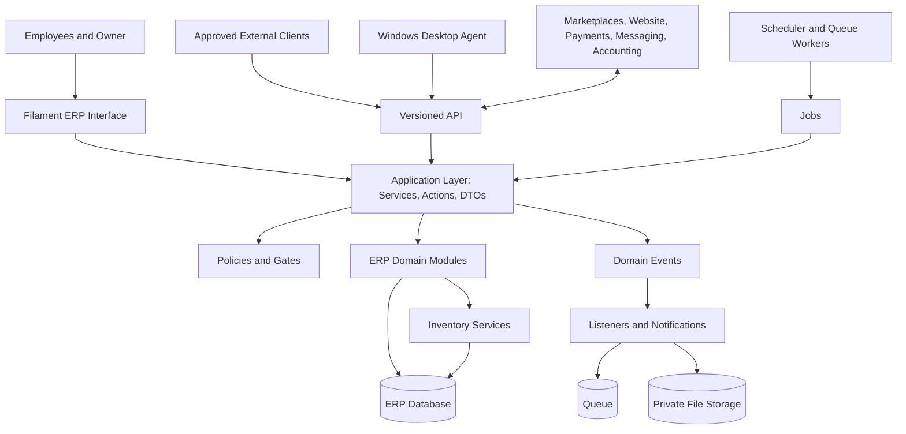
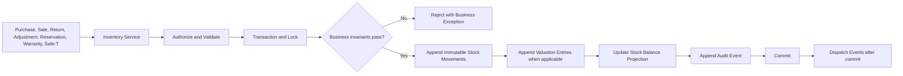
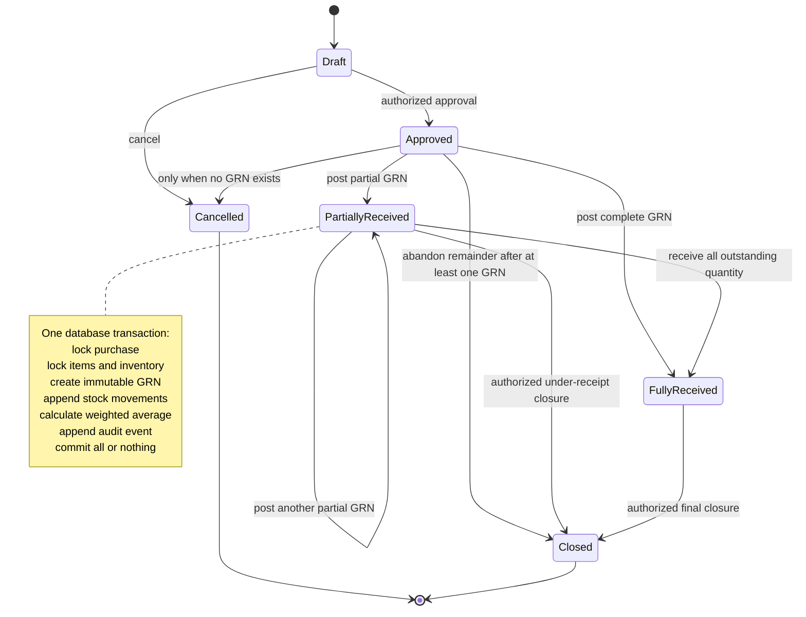
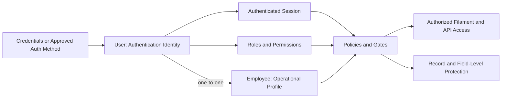
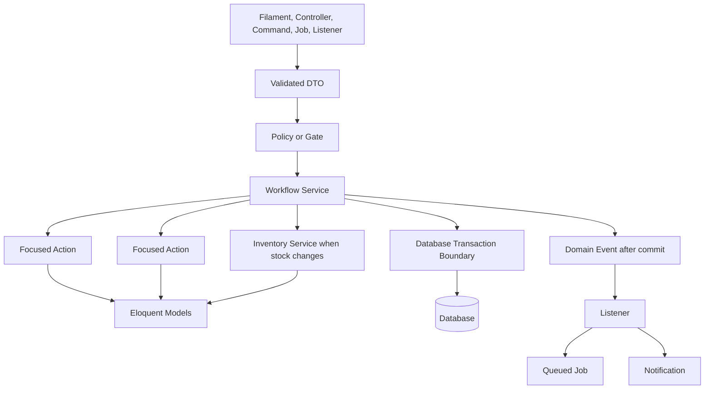

# TPZ ERP System Architecture

This document is the permanent technical architecture reference for the TPZ ERP. It governs future design and implementation decisions together with `PROJECT_CONTEXT.md` and `AGENTS.md`. Where a proposed change conflicts with an approved business rule, the business rule takes priority and the conflict must be raised for approval.

This document defines architecture; it does not authorize implementation. Every major module, schema change, dependency, integration, or authentication change requires an explained plan and explicit approval before work begins.

## 1. Architecture Principles

### Domain-driven business logic

- Code is organized around business capabilities such as purchasing, inventory, sales, returns, warranty, Safe-T, tasks, and accounting.
- Domain language in code must match approved business language.
- Business invariants belong in the application/domain layer, not in Filament pages, controllers, console commands, or database UI code.
- Module boundaries must be explicit. Modules communicate through typed calls and domain events rather than by changing one another's tables directly.

### Single responsibility principle

- Every class has one clear reason to change.
- Large workflows are composed from focused Actions, Services, DTOs, Policies, Events, Listeners, and Jobs.
- Shared code is extracted only when it represents a stable, meaningful concept; unrelated behavior is not grouped merely for convenience.

### Service-oriented business workflows

- Services coordinate complete workflows and transaction boundaries.
- Actions perform one named business operation and can be composed by Services.
- Entry points—including Filament Actions, controllers, Jobs, and commands—delegate to the same Services so rules cannot diverge by interface.
- Critical workflows are idempotent where requests, imports, webhooks, or Jobs may be retried.

### Immutable financial transactions

- Posted financial entries are append-only.
- Corrections use linked reversals and replacement entries; posted records are not silently edited or deleted.
- Every financial entry identifies its source document, actor or system process, posting time, currency, and reversal relationship where applicable.
- Draft business documents may be editable, but posting creates immutable accounting and inventory consequences.

### Inventory as the single source of truth

- The inventory ledger and immutable stock movements are authoritative for physical and logical stock quantities.
- All inventory summaries are derived from, or transactionally maintained from, the ledger.
- Purchases, orders, returns, warranty, Safe-T, damaged stock, assignments, and adjustments never maintain competing stock balances.
- Every stock mutation passes through an approved Inventory Service inside a database transaction.

### Security by default

- Access is denied unless explicitly authorized.
- Authorization is enforced at the UI, policy, query, field, Service, file-delivery, export, API, and Job boundaries as appropriate.
- Financial, authentication, personal, monitoring, and screenshot data are treated as sensitive.
- Inputs are validated, outputs are scoped, files are private by default, secrets are never logged, and important actions are audited.

### Test-driven development where practical

- Business invariants and acceptance criteria are expressed as tests before or alongside implementation where practical.
- Inventory, costing, authorization, idempotency, reversals, and concurrency receive focused automated coverage.
- A failing regression test should reproduce a confirmed defect before the fix when practical.

## 2. Laravel Folder Structure

Business classes should be grouped by domain below their layer when a folder grows. For example, `app/Actions/Inventory`, `app/Services/Purchasing`, and `app/DTOs/Sales`. This preserves familiar Laravel conventions while keeping module ownership visible.

```text
app/
├── Actions/
├── Services/
├── DTOs/
├── Enums/
├── Policies/
├── Models/
├── Events/
├── Listeners/
├── Jobs/
├── Notifications/
├── Support/
├── Traits/
├── Exceptions/
└── Observers/
```

### `app/Actions/`

Contains focused classes that execute one business operation, such as completing a purchase, reserving stock, accepting a return, or assigning a brand. An Action validates business preconditions but does not become a general-purpose utility container.

### `app/Services/`

Contains workflow coordinators and domain services. Services compose Actions, establish transaction boundaries, enforce cross-entity invariants, request authorization when invoked outside an already authorized boundary, and dispatch after-commit events.

### `app/DTOs/`

Contains immutable or effectively immutable typed data-transfer objects used at application boundaries. DTOs normalize validated input and make Service and Action contracts explicit; they do not query the database or contain workflow logic.

### `app/Enums/`

Contains PHP backed enums for stable business states and types, such as purchase status, stock movement type, return condition, and role identifiers. Enums provide labels and presentation metadata only when that metadata remains simple and stable.

### `app/Policies/`

Contains model and domain authorization policies. Policies define who may view, create, update, post, reverse, export, or access sensitive fields and files.

### `app/Models/`

Contains Eloquent models representing persisted data, relationships, casts, narrowly scoped query helpers, and structural invariants. Models must not coordinate multi-record business workflows or hide stock and financial mutations in generic model events.

### `app/Events/`

Contains immutable facts emitted after meaningful business outcomes, such as `PurchaseCompleted` or `TaskAssigned`. Events describe what happened and carry stable identifiers; they do not perform work.

### `app/Listeners/`

Contains reactions to Events, such as creating an internal notification or updating a non-authoritative projection. Listeners must be idempotent and must not create hidden circular dependencies between modules.

### `app/Jobs/`

Contains retryable background work such as imports, exports, email delivery, marketplace synchronization, screenshot-retention cleanup, and report generation. Jobs delegate business changes to the same Services used by synchronous entry points.

### `app/Notifications/`

Contains Laravel Notification classes and their channel-specific presentation. Notifications announce an already authorized business event; they do not implement the underlying business operation.

### `app/Support/`

Contains small, framework-adjacent shared primitives such as money helpers, clock abstractions, identifiers, result objects, and query utilities. It must not become a miscellaneous dumping ground or bypass domain boundaries.

### `app/Traits/`

Contains narrowly focused, behaviorally cohesive traits where composition is genuinely appropriate. Traits must not conceal authorization, transactions, stock mutations, or important side effects.

### `app/Exceptions/`

Contains meaningful business and application exceptions, such as insufficient stock, invalid state transition, duplicate posting, or unauthorized financial access. Exceptions should be safe to render and must not leak secrets or sensitive values.

### `app/Observers/`

Contains Eloquent lifecycle observers for non-critical, model-local concerns such as audit metadata when explicitly approved. Observers must not post inventory, accounting, purchase, sales, return, or other critical transactions because their side effects are too implicit.

## 3. Business Logic Rules

- Filament Resources must never contain business logic. They define presentation, form schemas, table schemas, UI authorization hints, and calls into approved Actions or Services.
- Controllers remain thin. They validate or receive validated DTOs, authorize the request, invoke a Service or Action, and format the response.
- Services coordinate business workflows, cross-module collaboration, transaction boundaries, locking, idempotency, and after-commit effects.
- Actions perform one clearly named business operation and return a typed or documented result.
- Models represent data only: persistence mapping, relationships, casts, and limited query scopes. They do not orchestrate business workflows.
- Policies authorize actions and sensitive record access. UI visibility alone is never authorization.
- Events notify other modules that a completed business fact occurred. They are dispatched only after the authoritative transaction commits when listeners could observe persisted state.
- Jobs perform background work and delegate all business mutations to approved Services.
- Listeners and Jobs must tolerate retries and avoid duplicate side effects.
- Database constraints reinforce business rules but do not replace validation and domain checks.
- Inventory and financial writes never occur through ad hoc model updates from UI code.

## 4. Inventory Architecture

### Product Inventory

- A Product is identified by title and unique SKU; serial-number tracking is outside the approved scope.
- Inventory is held in the single physical warehouse and categorized by approved logical stock state, such as available, reserved, damaged, Safe-T, or warranty custody.
- Virtual employee or brand assignment is operational metadata and never creates a second physical stock ledger.
- Current balances may be maintained as a transactionally updated projection for speed, but immutable Stock Movements remain the authority.

### Stock Movements

- Every quantity mutation creates one or more immutable Stock Movement entries.
- Each entry records product, warehouse, stock state or location, signed quantity or explicit direction, movement type, source type and identifier, actor, effective time, posting time, idempotency key, and reason where required.
- Transfers between stock states are represented by balanced outbound and inbound entries linked by one transaction or transfer identifier.
- Posted movements are never edited or deleted through normal workflows. Corrections append linked reversing movements.
- A unique source/idempotency constraint prevents duplicate posting.

### Weighted Average Cost

- Average cost is derived from eligible completed purchase receipts, not from the Product's `cost_price`.
- Before an inbound receipt, the inventory valuation is the existing on-hand quantity multiplied by its current weighted-average cost.
- The eligible receipt value is added to existing inventory value, and the new weighted-average cost is total inventory value divided by total eligible on-hand quantity.
- Outbound stock uses the average cost effective at posting and does not itself recalculate the unit average.
- Cost calculations use fixed-point decimal arithmetic; binary floating-point is prohibited.
- Zero-stock behavior, purchase returns, landed costs, backdating, rounding, and customer-return cost restoration must follow separately approved accounting rules.
- Average cost, cost of goods sold, stock value, and gross profit are owner-only.

### Opening Stock

- Opening stock is a controlled, one-time or explicitly approved setup workflow.
- Each opening quantity and approved opening unit value posts an immutable opening movement and valuation entry.
- Opening stock requires a source reference, actor, effective date, reason, and approval evidence.
- Completed Opening Stock is immutable and has no first-release reversal document. Corrections use a separately authorized Inventory Adjustment with mandatory reason, immutable Stock Movement, idempotency protection, Activity Log, negative-stock prevention, before/after balances, and Owner-only financial handling where applicable.

### Purchase Receiving

- Only an approved Purchase may receive stock. A Purchase belongs to one Warehouse in this release.
- Partial receiving and multiple immutable Goods Received Notes are supported until all ordered quantities are satisfied or the Purchase is manually closed.
- Each receiving operation locks and validates the Purchase, Purchase Items, and Product Inventory balances in deterministic order; creates one immutable Purchase Receipt and its immutable items; appends Stock Movements; recalculates weighted-average cost; updates received quantities and Purchase status; and records safe audit history in one database transaction.
- Accepted quantity enters Available inventory. Damaged quantity enters Damaged inventory and remains valued. Rejected quantity enters no inventory and creates no Stock Movement.
- One shared movement-group UUID identifies a GRN. Each valuation-bearing Receipt Item creates at most one combined Stock Movement sourced as `purchase_receipt_item`.
- Posted receipts cannot be edited or deleted. Corrections require a separately approved reversal, return, or adjustment workflow.
- Events and notifications that depend on completion are dispatched after commit.

### Purchase Reversal

- A completed purchase is never returned to draft by deleting its stock or valuation history.
- An authorized reversal validates available quantity and downstream constraints, then posts linked inverse stock and valuation entries using the approved original cost basis.
- A reversal must not cause negative stock or invalid valuation. If later consumption prevents a safe reversal, the workflow stops for an approved corrective process.
- The original purchase and posting remain visible and auditable.

### Reservation

- Reservation moves or allocates quantity from available to reserved through the Inventory Service.
- Available-to-promise quantity accounts for active reservations.
- Reservation, release, expiry, cancellation, and fulfilment are idempotent and auditable.
- Concurrent reservation attempts use locking or an equivalent atomic safeguard to prevent overselling and negative availability.

### Safe-T

- Damaged marketplace returns enter the approved Damaged/Safe-T stock state through an immutable transfer or inbound movement.
- Claim submission and reimbursement do not automatically change physical quantity.
- Authorized final disposition—return to available, supplier return, disposal, repair, or another approved outcome—posts explicit movements.

### Warranty

- Warranty workflows track custody and status without inventing stock.
- Moving an item into or out of warranty custody passes through the Inventory Service and posts linked movements.
- Repair, replacement, supplier return, customer return, or write-off requires an explicit authorized outcome.

### Damaged Stock

- Damaged stock is a distinct logical stock state and is excluded from available quantity.
- Damage classification records the source, condition, evidence, actor, and reason.
- Repair, recovery, Safe-T transfer, supplier return, or disposal creates a new immutable movement; the original damage event remains unchanged.

### Inventory Service boundary

Every stock mutation—including opening balances, receipt, reversal, reservation, release, fulfilment, return, adjustment, warranty transfer, Safe-T transfer, damage, recovery, disposal, and correction—must pass through Inventory Services. Direct stock updates from Filament Resources, controllers, Models, Observers, Jobs, Listeners, imports, seeders used in production, or integrations are prohibited.

## 5. Database Standards

### Naming conventions

- Use Laravel conventions: plural `snake_case` table names, singular `snake_case` columns, and descriptive names.
- Primary keys use `id` unless an approved external or distributed identifier strategy requires otherwise.
- Foreign keys use `<model>_id`; polymorphic columns follow Laravel's `<name>_type` and `<name>_id` convention.
- Timestamps use clear `_at` names. Boolean columns use positive `is_`, `has_`, or `can_` names.
- Constraints and indexes use stable descriptive names where framework-generated names would be ambiguous or too long.

### Foreign keys

- Every real relationship uses a foreign-key constraint where supported.
- Delete behavior is explicit. Prefer `restrict` for business history and critical master data, and use `nullOnDelete` only when losing the optional link is acceptable.
- Cascading deletion is limited to true dependent records that have no independent audit or business value.
- Historical stock, financial, audit, task timeline, and monitoring references must not be destroyed by cascades.

### Index strategy

- Index foreign keys and columns used frequently for filtering, joins, ordering, or uniqueness.
- Use composite indexes that match actual query prefixes, such as source identity, product/warehouse/time, employee/session/time, and status/due date.
- Enforce business uniqueness in the database for SKU, idempotency keys, external channel identifiers, and one-to-one User/Employee links as applicable.
- Verify indexes with representative query plans; avoid redundant and speculative indexes that increase write cost.

### Soft delete policy

- Soft deletes are used only for records that may be operationally deactivated or restored and whose uniqueness and relationships have an approved policy.
- Immutable transactions, stock movements, financial entries, audit events, task timeline events, and access logs are not soft-deleted as a substitute for retention or reversal.
- Master data with historical references is normally deactivated rather than deleted.
- Privacy or retention deletion is implemented as an explicit controlled workflow, not an informal soft-delete convention.

### Immutable tables

- Stock movements, posted valuation entries, posted accounting entries, task timeline events, and other approved ledgers are append-only.
- Application permissions deny update and delete operations on immutable records.
- Corrections use reversal or superseding records linked to the originals.
- Database protections may reinforce immutability after compatibility and operational recovery needs are approved.

### Audit tables

- Audit entries record actor, action, subject type and identifier, timestamp, request or correlation identifier, source channel, approved before/after metadata, and reason where required.
- Sensitive secrets, passwords, tokens, full payment details, and unnecessary screenshot content are never stored in audit payloads.
- Audit records have restricted access, retention rules, integrity protections, and controlled exports.

### Decimal precision

- Never use binary floating-point for money, costs, rates, taxes, or valuation.
- Store unit cost and weighted-average cost as `DECIMAL(15,4)`. Store selling prices, line totals, and document totals as `DECIMAL(15,2)`. Use half-up rounding to four decimals for internal costing and two decimals for AED presentation and totals.
- Display rounding and storage precision are separate concerns. AED may be displayed to two decimal places while calculations preserve approved internal precision.
- Quantities use integer types when products are indivisible; fractional quantities require explicit approval and a fixed decimal definition.
- Rounding mode and the point at which rounding occurs must be centralized and tested.

### Enum usage

- Use PHP backed enums for stable application states and types.
- Persist stable string values whose meaning does not depend on display labels.
- Prefer string columns with validation and application enums over database-native enum types when states may evolve; database `CHECK` constraints may reinforce stable values where supported and approved.
- Never rename a persisted enum value without a data migration and compatibility plan.

## 6. Authentication

```text
User
  ↓ one-to-one
Employee
```

- `User` remains the Laravel authentication model and security identity.
- `Employee` represents the employment profile and operational identity.
- A unique one-to-one relationship links each Employee to one User, and each User account used by an employee to one Employee.
- Keeping authentication on User preserves Laravel and Filament authentication conventions, password handling, sessions, remember tokens, verification, multi-factor extensions, and security tooling without mixing them into HR data.
- Roles and permissions attach to the authenticated User. Operational records reference Employee when the business meaning is employment-related and may also record the acting User for audit integrity.
- Deactivating employment disables authentication while preserving historical records.
- Shared accounts are prohibited. Authentication changes require explicit approval.

## 7. Authorization

### Policies

- Policies are the primary authorization mechanism for records and domain actions.
- Policies cover viewing, listing, creating, updating, deleting where permitted, posting, reversing, approving, exporting, restoring, and access to sensitive files or fields.

### Gates

- Gates cover cross-cutting abilities that do not naturally belong to one Model, such as viewing owner dashboards, accessing system settings, or running compliance exports.
- Gates do not replace record-aware Policies.

### Role enums

- Stable system role identifiers are represented by PHP backed enums.
- Permissions remain granular; code should check capabilities through Policies or Gates rather than scattering role-name comparisons.
- The owner role is protected from unauthorized assignment, removal, or privilege reduction.

### Owner-only financial data

- Gross profit, average cost, cost of goods sold, stock value, purchase-cost analytics, and sensitive accounting data are owner-only unless an explicit narrower permission is approved.
- Protection applies to queries, fields, tables, widgets, infolists, exports, APIs, search, notifications, logs, and Jobs.

### Field-level protection

- Sensitive fields are omitted at the query or serialization boundary when practical, not only visually hidden.
- Filament schemas conditionally display protected fields, but server-side Policies, Gates, DTO construction, resources, and export queries remain authoritative.
- Mass assignment and request validation must prevent unauthorized writes to protected fields.

### Service-level authorization

- Public application Services either accept an explicitly authenticated actor and authorize the operation or are invoked only from a documented authorized boundary.
- Jobs and Listeners use a recorded actor or explicit system identity and still enforce domain permissions and invariants.
- Integrations receive least-privilege service identities and cannot bypass Inventory or financial rules.

## 8. Filament Standards

### Forms

- Forms provide clear labels, help text, required indicators, sensible grouping, server-side validation, relationship scoping, and safe defaults.
- Reactive behavior improves usability but never becomes the only enforcement of a rule.
- Sensitive fields are excluded unless authorized. Financial calculations displayed in forms are read-only unless a specifically approved input is required.

### Tables

- Tables use relevant searchable and sortable columns, deliberate default sorting, useful filters, pagination, and eager loading for displayed relationships.
- Owner-only columns are excluded from unauthorized queries and views.
- Destructive or posting Actions are never exposed as casual row operations.

### Widgets

- Widgets use authorized, scoped, and efficient queries.
- Operational and financial widgets are separated so restricted figures cannot leak through totals, tooltips, caching, or drill-down links.
- Expensive widgets use approved caching with user and permission-aware keys.

### Relation Managers

- Relation Managers handle genuinely subordinate relationships and obey both parent and related-record Policies.
- They do not directly mutate inventory, financial ledgers, or immutable history.
- Complex workflows link to or invoke an approved Action or Service.

### Actions

- Filament Actions confirm high-impact operations, gather validated input and reasons, authorize, and delegate to application Actions or Services.
- Posting, approval, reversal, and stock mutation Actions are idempotent and display a clear outcome.

### Bulk Actions

- Bulk Actions are disabled for workflows that require per-record validation, ordering, locking, or individual approval unless a purpose-built batch Service is approved.
- Bulk operations report partial failures safely and never bypass record Policies.

### Infolists

- Infolists are the preferred read-only presentation for record detail when editing is not appropriate.
- Sensitive entries are authorization-aware and immutable history is clearly distinguished from current state.

### Navigation

- Navigation follows business modules and the employee's permissions.
- Labels and grouping use approved domain language and avoid exposing inaccessible record counts.
- Owner-only finance and administration navigation is isolated from operational navigation.

### Icons

- Use one consistent Filament-supported icon family and select icons by stable semantic meaning.
- Do not rely on icons alone; actions include accessible text or labels.
- New icons must match existing navigation and action conventions.

### Color standards

- Use semantic colors consistently: neutral for information, primary for the normal next action, success for completed or healthy states, warning for attention, and danger for destructive, failed, damaged, or blocked states.
- Color is never the only status indicator; pair it with text and accessible contrast.
- Financial gain or loss coloring must remain owner-only when the underlying values are restricted.

### Read-only resources

- Immutable stock, valuation, accounting, audit, task timeline, screenshot access, and other ledger records use read-only Resources where UI access is required.
- Read-only Resources do not expose create, edit, delete, restore, bulk mutation, or inline-edit controls.
- Authorized reversals and corrections are separate named workflows, never generic edits.

## 9. API Standards

### Future APIs

- APIs are introduced only for approved business needs such as marketplace connectors, the website, payment gateways, or the desktop monitoring agent.
- APIs call the same Services and Policies as Filament and never duplicate business logic.
- API contracts, consumers, data scope, and lifecycle are documented before release.

### Authentication

- Human and machine clients use an approved Laravel-compatible authentication mechanism with least-privilege abilities, rotation, revocation, expiry, and auditability.
- Service credentials are distinct from employee passwords and are never stored in source control or logs.

### Versioning

- Public or integration APIs are versioned explicitly, preferably using a URI prefix such as `/api/v1` unless an approved gateway standard says otherwise.
- Breaking changes require a new version, migration guidance, and a defined deprecation period.

### Response format

- Responses use a consistent JSON envelope for data, metadata, links where useful, and structured errors.
- Timestamps use ISO 8601 with timezone. Money includes amount and currency; internal precision is not silently lost.
- Stable machine codes accompany human-readable errors.

### Validation

- Dedicated Form Requests or equivalent validated DTO factories validate shape, type, allowed values, ownership, and cross-field constraints.
- Domain Services recheck business invariants because API validation alone is not sufficient.

### Rate limiting

- Limits are defined by client type and endpoint risk.
- Authentication, uploads, imports, webhooks, search, and expensive reports receive specific controls.
- Idempotency keys and safe retry guidance are required for mutation endpoints that may be retried.

## 10. Notifications

### Email

- Email is used for approved external or high-value notifications and is queued by default.
- Templates avoid sensitive financial, monitoring, or credential data unless the recipient and channel are explicitly approved.
- Delivery failures are retried and observable without duplicating the business operation.

### Internal notifications

- Filament/database notifications communicate actionable in-app events and link to authorized records.
- Notifications are not the authoritative record of a business event and may be marked read without changing domain state.

### Task notifications

- Approved events may include task assignment, reassignment, due-date change, mention, completion, reopening, and overdue status.
- Deduplication and recipient preferences apply without suppressing mandatory compliance notifications.

### Marketplace alerts

- Alerts cover approved synchronization failures, unmapped products, duplicate or conflicting orders, return deadlines, Safe-T deadlines, and credential or connectivity problems.
- Alerts include safe diagnostics and correlation identifiers but never secrets.

## 11. File Storage

### Invoices

- Invoice files are stored with stable business metadata, restricted access, integrity checks where appropriate, and retention aligned with approved accounting requirements.

### Warranty files

- Warranty evidence, service reports, and related documents are private and accessible only to authorized participants and reviewers.

### Attachments

- Attachments validate size, type, extension, and content where practical; filenames are generated rather than trusted from user input.
- Downloads are authorized against both the file and its parent record.

### Screenshots

- Employee working screenshots are highly sensitive private records associated with an Employee, Work Session, capture timestamp, enrolled agent/device, storage key, and audit metadata.
- The separate Windows desktop agent performs capture; Laravel governs policy, upload authorization, storage metadata, access, retention, and auditing.

### Private storage

- Sensitive files are never stored on a public disk or served from predictable public URLs.
- Access uses authenticated streaming or short-lived signed delivery after server-side authorization.
- Storage keys are opaque, and backups follow the same privacy and retention controls.

### Retention rules

- Each file category has an approved retention period, deletion schedule, legal-hold procedure, reviewer list, and audit requirement.
- Screenshot retention, notice or consent, pause behavior, exclusions, and deletion evidence must be approved before capture is enabled.
- Retention Jobs delete eligible objects and metadata in a controlled, idempotent, auditable process.

## 12. Background Jobs

### Queues

- Slow, retryable, or external work is queued. Interactive inventory and financial decisions remain transactionally authoritative before a Job is dispatched.
- Jobs define retry limits, backoff, timeout, uniqueness or idempotency behavior, failure handling, and monitoring.
- Jobs are dispatched after commit when they depend on newly persisted state.

### Email

- Email delivery is queued, retryable, deduplicated where required, and separated from business transaction success.

### Imports

- Imports validate rows, stage or preview risky changes, process in chunks, preserve source references, and produce an error report.
- Import Jobs call Services and cannot directly alter inventory or financial tables.

### Exports

- Large exports are queued, authorized at request and download time, privately stored, time-limited, and audited.
- Export content is permission-scoped so cached files cannot leak owner-only data.

### Marketplace synchronization

- Synchronization uses idempotent external identifiers, cursors or checkpoints, rate-limit handling, retries, reconciliation, and exception queues.
- Webhooks are authenticated and deduplicated; polling and webhook processing converge on the same Services.

### Scheduled tasks

- Scheduled work includes approved reservation expiry, reminders, marketplace reconciliation, retention enforcement, cleanup, and integrity checks.
- Schedules prevent overlapping runs where necessary and expose failures to authorized administrators.

## 13. Testing Standards

### Feature tests

- Feature tests cover complete authorized workflows through Filament, HTTP, commands, Jobs, or Services as appropriate.
- They verify validation, state transitions, persistence, events, notifications, audit records, and rejected paths.

### Unit tests

- Unit tests cover pure calculations and focused domain behavior such as money rounding, weighted-average cost, state-transition rules, DTO construction, and value objects.

### Policy tests

- Every protected Resource and major operation has allow-and-deny tests for relevant roles, ownership, record states, sensitive fields, exports, and files.
- Owner-only financial data must have explicit non-owner leakage tests.

### Concurrency tests

- Concurrency-sensitive workflows test competing reservations, purchase completion, fulfilment, reversals, imports, webhook retries, and duplicate Jobs.
- Tests prove idempotency and prevention of overselling, duplicate movements, and lost updates.

### Inventory integrity tests

- Tests reconcile stock balances to movements and valuation to approved costing entries.
- Required cases include opening stock, purchase completion, duplicate completion, purchase reversal, reservation and release, sale, OK return, damaged return, Safe-T disposition, warranty custody, adjustments, and rejected negative stock.

### Test execution

- Relevant focused tests run during development; the broader affected suite runs before handoff.
- Laravel Pint runs after application code changes.
- Tests must not depend on or destructively reset a non-test database.

## 14. Performance Standards

### Database indexing

- Indexes follow measured query patterns, relationship joins, uniqueness constraints, status filters, and chronological ledger access.
- Query plans are reviewed for high-volume stock, order, task, chat, monitoring, and audit tables.

### Caching

- Cache only data with a clear invalidation and authorization strategy.
- Inventory and financial source-of-truth writes never depend on eventually consistent cache values.
- User-specific or role-specific cache keys prevent sensitive-data leakage.

### Queue usage

- External calls, delivery, file processing, imports, exports, synchronization, and expensive reports use queues when synchronous completion is not required.
- Queue depth, failures, retries, and processing latency are observable.

### Lazy loading

- Accidental lazy loading and N+1 queries are prevented in development and tests where practical.
- Filament tables, APIs, Jobs, and exports explicitly eager-load the relationships they use.

### Chunk processing

- Large datasets are processed with `chunkById`, lazy iteration, cursor pagination, or an equivalent stable method.
- Jobs have bounded memory use and resumable checkpoints where a full restart would be unsafe or costly.

## 15. Error Handling

### Validation

- Input errors return actionable field-level messages without exposing internal implementation details.
- Domain invariants are checked again inside Services or Actions at the transaction boundary.

### Business exceptions

- Expected business failures use specific exceptions, such as insufficient stock, invalid transition, duplicate posting, closed period, or unauthorized reversal.
- Entry points translate them into safe UI or API responses while preserving a correlation identifier.

### Logging

- Logs are structured and include correlation, actor, module, operation, and source identifiers where safe.
- Passwords, tokens, credentials, full private-file URLs, unnecessary personal data, and owner-only values are not logged.
- Audit history and diagnostic logs have different responsibilities and retention rules.

### Recovery

- Database transactions roll back incomplete critical workflows.
- Retryable external failures use idempotent Jobs with backoff; permanent failures enter an observable failed state.
- Recovery never edits immutable history. It resumes, reverses, or posts a corrective operation through approved Services.
- Runbooks are required for high-risk inventory, financial, integration, queue, and storage failures.

## 16. AI Development Rules

Codex must:

- Explain plans first.
- Wait for approval before any major implementation.
- Never change business rules automatically.
- Never install packages without approval.
- Never change authentication without approval.
- Never perform destructive actions.
- Never run destructive database commands, including `migrate:fresh` or `db:wipe`.
- Explain database changes before implementation and create new migrations rather than modifying migrations that have already been used.
- Never modify `.env` without approval or expose credentials.
- Work on one module at a time.
- Always summarize changed files.
- Always run Laravel Pint and relevant tests after implementation.
- Preserve unrelated user changes in a dirty worktree.
- Never deploy or push directly to `main`.

Documentation-only work does not authorize application changes, migrations, dependency installation, or database access. If a requested implementation conflicts with `PROJECT_CONTEXT.md`, this reference, or `AGENTS.md`, Codex must stop, explain the conflict, and request direction.

## 17. Future Integrations

Every integration requires separate approval of its business scope, data ownership, credentials, authentication, permissions, rate limits, idempotency, reconciliation, failure recovery, privacy, retention, audit events, sandbox strategy, and tests.

### Amazon

- Potential scope includes order ingestion, fulfilment status, returns, Safe-T claims, fees, settlements, and reconciliation.
- Amazon identifiers must be idempotent and mapped to internal authoritative records.

### Noon

- Potential scope includes orders, fulfilment, returns, claims, fees, settlements, and reconciliation using the same integration boundaries as other marketplaces.

### Website

- A website may consume approved product availability and submit orders through a versioned API.
- The ERP remains authoritative for inventory and fulfilment state.

### Payment gateways

- Payment integrations use tokenized provider references; sensitive card data is never stored by the ERP.
- Webhooks are authenticated, idempotent, reconciled, and separated from order-state assumptions.

### WhatsApp

- Approved notifications or customer communication use official provider APIs, templates, consent rules, opt-out handling, and auditable delivery status.
- WhatsApp messages must not expose unauthorized financial, employee, or monitoring data.

### Accounting systems

- Integration exports or synchronizes approved journal, invoice, payment, tax, and reconciliation data without bypassing immutable internal posting rules.
- Ownership of each accounting record and conflict-resolution policy must be explicit.

### Desktop monitoring agent

- A separately built and approved Windows agent captures permitted activity and screenshots during valid work sessions.
- It uses secure device enrollment, least-privilege credentials, encrypted upload, offline idempotent retry, visible capture state, revocation, versioning, and approved update controls.
- Laravel stores policy and metadata, authorizes uploads and review, enforces retention, and audits access; it does not perform desktop capture.

## 18. Architecture Diagrams

### Overall system architecture



### Inventory flow



### Purchase workflow



### Authentication



### Service architecture



## Approval Status

This architecture reference is documentation only. It introduces no application behavior, database schema, dependency, configuration, or integration. Implementation must stop at the planning boundary until the owner explicitly approves the relevant module and its detailed plan.
